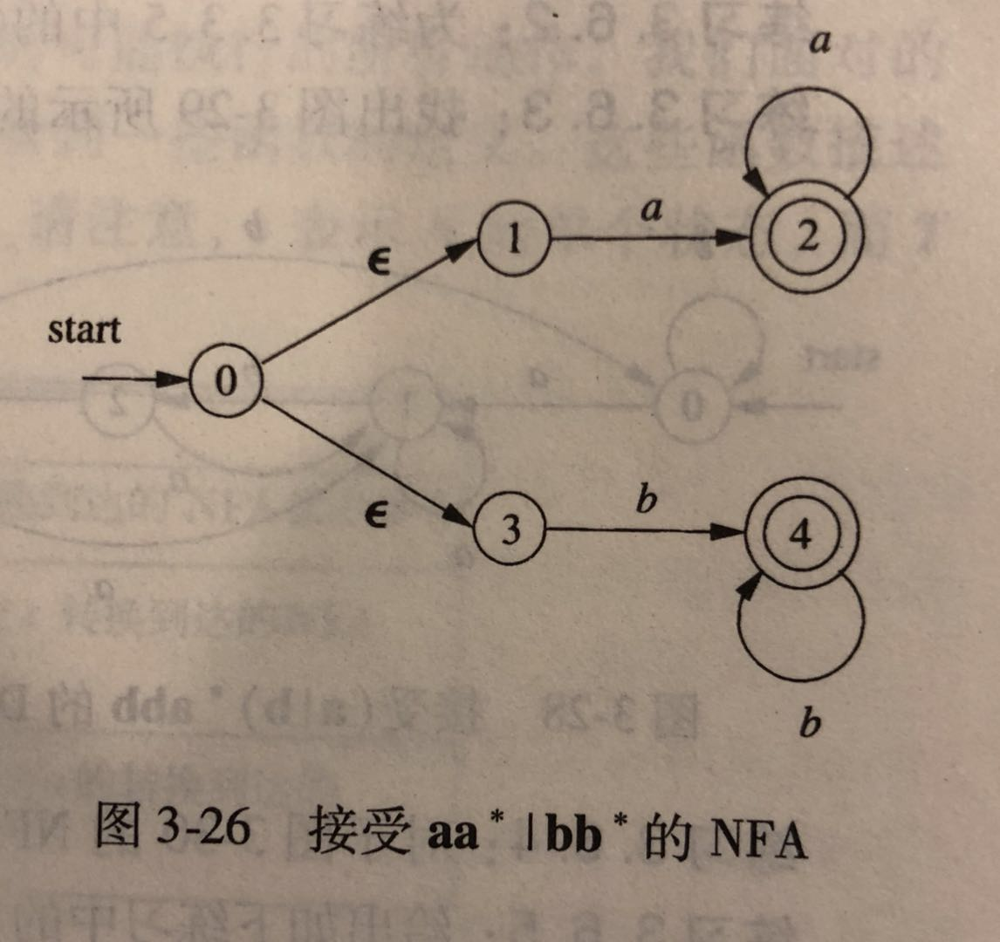
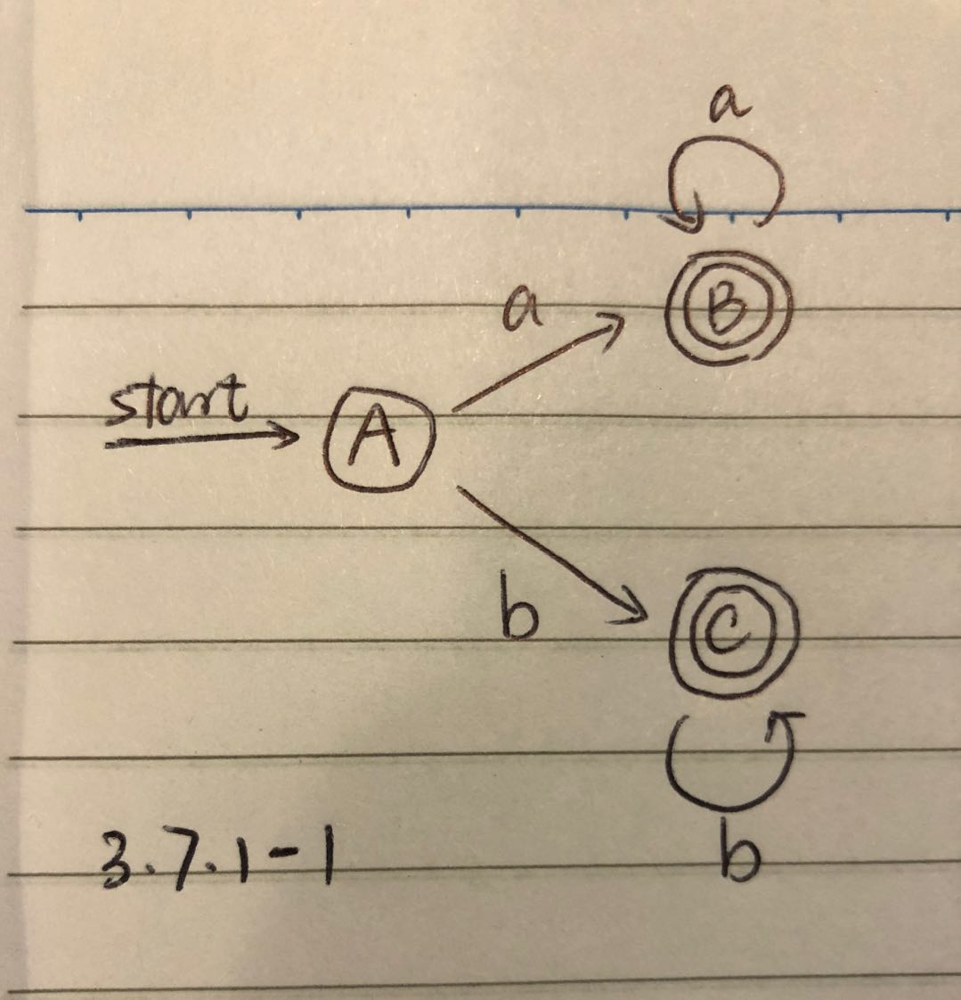
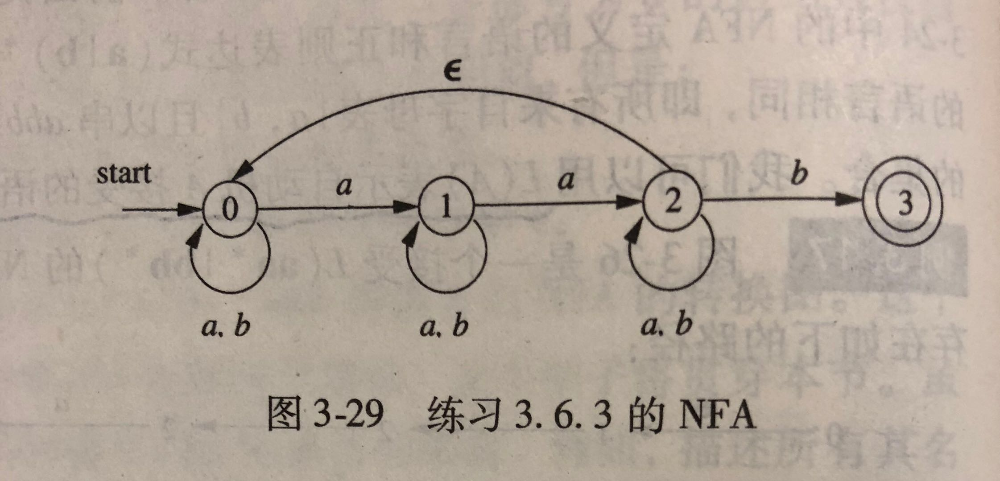
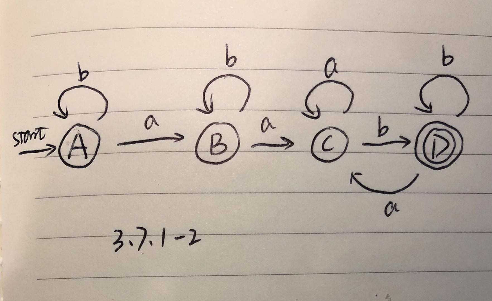

## 3.7 从正则表达式到自动机

### 3.7.1
将下列图中的 NFA 转换为 DFA。

1）图 3-26



```
A = ∈-closure(0) = {0, 1, 3}
B = Dtran[A, a] = ∈-closure(move(A, a)) = {2}
C = Dtran[A, b] = ∈-closure(move(A, b)) = {4}
Dtran[B, a] = {2} = B
Dtran[C, b] = {4} = C
```

| NFA 状态 | DFA 状态 | a | b |
| ---- | -------- | -------- | ----- |
| {0, 1, 3} | A | B | C |
| {2} | B | B | Ø |
| {4} | C | Ø | C |



2）图 3-29



```
A = {0}
B = Dtran[A, a] = ∈-closure({0, 1}) = {0, 1}
Dtran[A, b] = ∈-closure({0}) = {0} = A
C = Dtran[B, a] = {0, 1, 2}
Dtran[B, b] = {0, 1} = B
Dtran[C, a] = {0, 1, 2} = C
D = Dtran[C, b] = {0, 1, 2, 3}
Dtran[D, a] = {0, 1, 2} = C
Dtran[D, b] = {0, 1, 2, 3} = D
```

| NFA 状态 | DFA 状态 | a | b |
| ---- | -------- | -------- | ----- |
| {0} | A | B | A |
| {0, 1} | B | C | B |
| {0, 1, 2} | C | C | D |
| {0, 1, 2, 3} | D | C | C |


